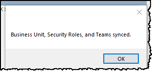

# XrmToolBox.CloneUserSetup

CloneUserSetup will clone Business Unit, Security Roles, and Team memberships from a source user to a destination user.  
Note the Destination User's Security Business Unit, Security Roles, and Team Memberships will be cleared and replaced with those from the Source User.

To use, it couldn't be simpler:
1. Pick a Source User and a Destination User and click the `COPY Business Unit, Security Roles, and Teams` button.

- Click Yes to Confirm.

2. The system will set the Business Unit on the Destination to match the Source User,  clone the Security Roles, and finally copy all Team memberships.

3. Finished!  Clicking OK will refresh the Destination User.
- 
- Source User has been cloned to the Destination User.

## Notes:
- Click the `Open` button on the Source User or the Destination user to navigate to the user record in D365.  It defaults to the legacy interface where you can admin whatever you need to (Security Roles in particular).
If you want the newer UCI interface simply check the `Open Links in UCI Interface` box and then click the `Open` button.
