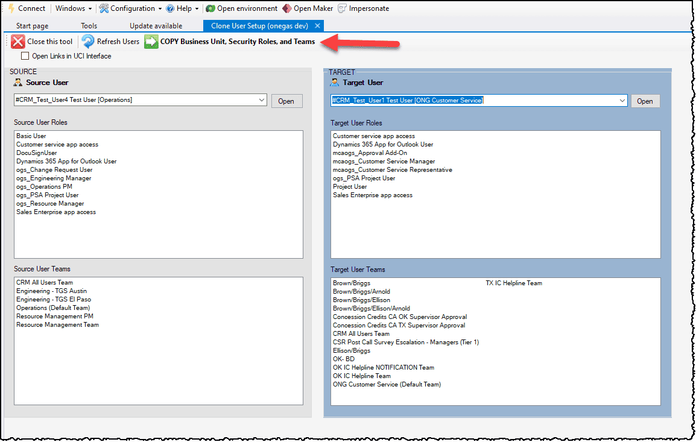
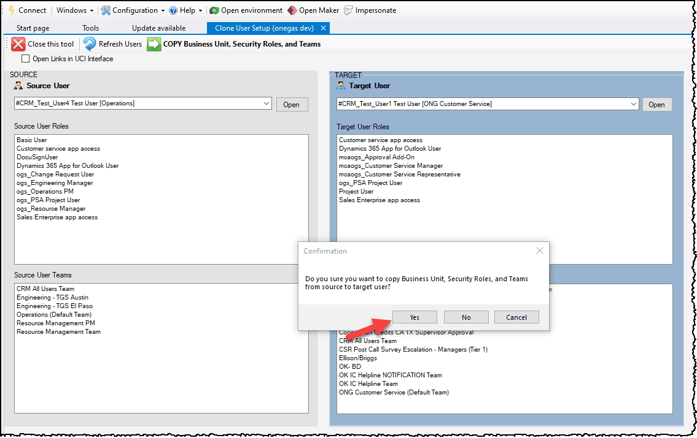
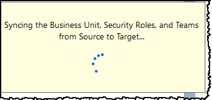
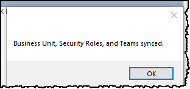
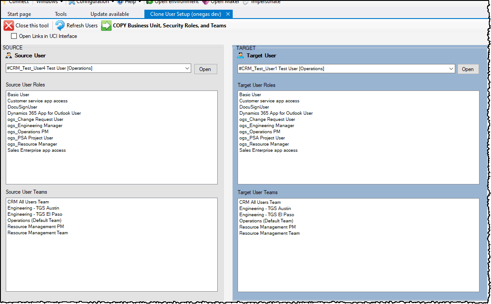

# XrmToolBox.CloneUserSetup

CloneUserSetup will clone Business Unit, Security Roles, and Team memberships from a Source User to a Target User.  
**Important Note:** the Target User's Business Unit, Security Roles, and Team Memberships will be cleared and replaced with those from the Source User.

## Usage
1. Pick a Source User and a Target User and click the `COPY Business Unit, Security Roles, and Teams` button.

- Click `Yes` to Confirm.

2. The system will set the Business Unit on the Target to match the Source User, then clone the Security Roles and Team Memberships.  
    

3. Finished!  Clicking `OK` will refresh the Target User.  

-  The Source User's Busines Unit, Roles, and teams have been cloned to the Target User.

## Notes:
- Click the `Open` button on the Source User or the Target User to navigate to the user record in Dynamics 365.  It defaults to the legacy interface where you can further administer the Security Roles with ease.
If you prefer the newer UCI interface simply check the `Open Links in UCI Interface` box and then click the `Open` button.
